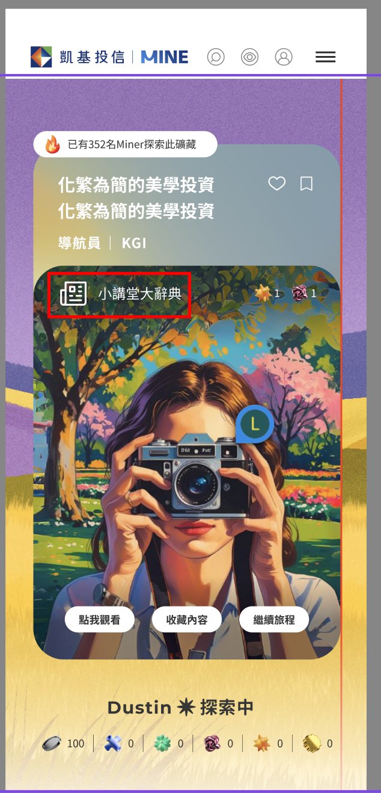

# 為沈浸模式設定public folder

`在html裡面為React-dom 準備的 div 上設定data set即可，[data-base-uri=public-folder-URI]`

```html
<div id="immersive_experience_section" data-base-uri="https://npm-demo.b-cdn.net/kgi/"></div>
<script type="module" src="./index.tsx"></script>
```

# 6/17 已知未完成或是錯誤

[測試連結](https://6a3271b4a18e574a2fd89bd0--kgi-miner.netlify.app/)

## 1. 連結到 `login page` 在 帶token redirect回來還沒串，不確定後端是否完成？

## 2. 用[測試帳號]抓 `immersion/content` 抓到的都是一樣的內容

## 3. 下面圖片圈起來的地方，api缺失該欄位。icon是否為固定？



## 4. 用[測試帳號]測試 iframe 的 postMessage 應該未實裝，而且部分URL是404

## 5. 幫我確認一下，偏好礦內容或是非偏好內容應該是用`immersion/content`同一隻抓？

```text
因為都content都是抓一樣的，不確定是否會按照全部互動後自動轉換 偏好/非偏好 礦內容。
```
